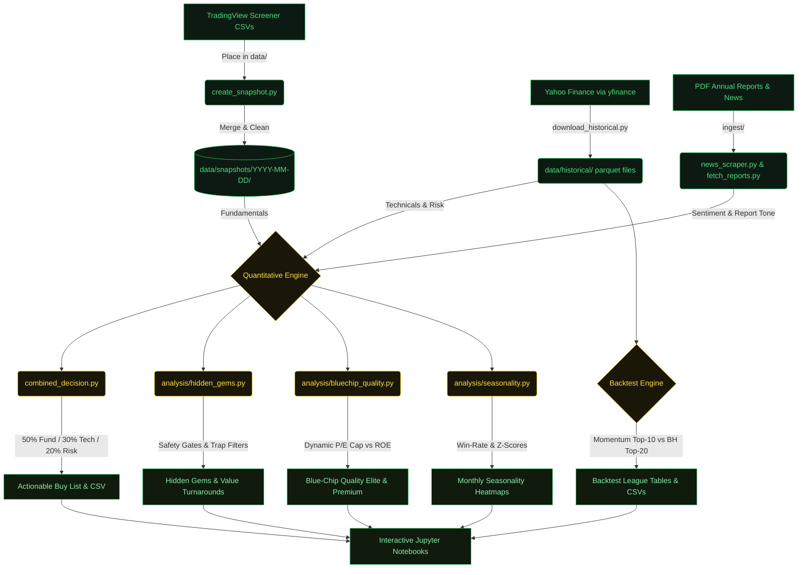

<div align="center">




<br/>

# JSE Stock Analysis & Backtesting System


[**Architecture**](#-system-architecture--data-flow) &middot; [Screens](#%EF%B8%8F-core-capabilities--investment-screens) &middot; [Structure](#-project-structure) &middot; [Quick-Start](#-setup--quick-start-guide) &middot; [Glossary](#-key-metrics-glossary)

</div>

---

A production-grade, multi-dimensional quantitative investment and research platform tailored for the **Johannesburg Stock Exchange (JSE)**.

This platform aggregates 5-year historical pricing datasets and real-time screener metrics to scan, filter, rank, and backtest sophisticated investment strategies. It incorporates fundamental analysis, technical indicators, seasonality tracking, PDF annual report sentiment analysis, and safety-gated screener engines.

---

## 📊 System Architecture & Data Flow



---

## 🛠️ Core Capabilities & Investment Screens

### 1. JSE Combined Decision System (`combined_decision.py`)
Merges fundamental growth metrics with technical indicators and historical risk data to synthesize a single unified score for all liquid JSE stocks.

| Component | Weight | Metrics |
|---|---|---|
| 📈 Fundamentals | 50% | EPS growth, ROE, Net Margin, Revenue Growth, Debt/Equity, Current Ratio |
| 📉 Technicals | 30% | SMA50/200 trend, 12-month momentum, RSI (40–60 sweet-spot), MACD crossovers |
| 🛡️ Risk | 20% | Annual Sharpe ratio, Max Drawdown (1-year), Annualized Volatility |

- **Liquidity Gate:** Excludes stocks trading less than **R1,000,000/day** to ensure meaningful entry and exit.
- **Outputs:** Actionable Buy List (Top 25), Avoid List (Bottom 10), and a deep-dive into the top 5 picks.

---

### 2. Hidden Gems & Value Turnarounds (`analysis/hidden_gems.py`)
Finds fundamentally excellent companies that are currently out-of-favor or ignored by the market — the *"beaten-down ready to run"* opportunity set.

**Value Trap Filters (v2.0)** automatically block accounting anomalies:
- Net margin > 30% but Free Cash Flow margin deeply negative (paper earnings, not real cash)
- Finance-sector stocks with net margins above 70% (almost always one-time events)
- EPS spikes > 500% with no revenue support (one-time non-recurring gains)
- Profitable companies with zero dividend payout and poor ROE (management doesn't trust its own earnings)
- Shell company flags: < 50 employees with > R10B market cap

**v2.1 Safety Gates:**
- **Valuation Cap:** Blocks paying more than 20x earnings for a "hidden gem" (NaN P/E is allowed through for early-stage profitable companies)
- **Liquidity Floor:** Enforces a minimum of **R10,000,000/day** volume
- **Falling-Knife Guard:** Excludes any stock down more than **30% in 3 months** — labels cold trend as *"Falling — verify before buying"*

**Value Turnarounds:** Separately surfaces profitable, historically robust businesses pulling back into discount zones, with the same safety gates applied.

---

### 3. Blue-Chip Quality Screener (`analysis/bluechip_quality.py`)
Designed to catch premium, compounding market leaders (e.g., Standard Bank, Naspers, Shoprite, MTN) — stocks that are rarely "hidden" but represent outstanding quality.

Unlike Hidden Gems, **no negative momentum requirement** is imposed. The dynamic P/E cap adapts to quality:

```
P/E Cap = 15.0
         + ROE Bonus: +1x for every 5% ROE above 15%  (max +5x)
         + EPS Growth Bonus: +1x for every 20% EPS above 20%  (max +5x)
         [Hard ceiling: 35x]
```

This means a high-ROE, fast-growing business (like Capitec or Discovery) is allowed a higher valuation than a mediocre compounder, reflecting the economic reality that quality earns premium multiples.

**Entry Timing Signals:** Based on RSI — *Oversold — Buy*, *Buy Zone*, *Accumulate*, *Cautious*, or *Wait — Overbought*.

**Tier Classification:** Stocks are labelled 🏆 Elite (score ≥ 70), ⭐ Premium (≥ 55), ✅ Quality (≥ 40), or 📊 Watchlist.

---

### 4. Seasonality Analyzer (`analysis/seasonality.py`)
Processes 5+ years of historical monthly returns to detect recurring, calendar-based performance patterns.

- **Z-Scored Magnitude:** For each month, computes a z-score of that month's average return against the stock's own historical cross-section.
- **Win-Rate Consistency:** Measures how often (%) a month has historically delivered a positive return.
- **Composite Score:** `0.7 × z-scored magnitude + 0.3 × win-rate consistency` → squashed to [-1, +1].
- **Warnings:** Issues a seasonal warning flag when a stock is entered during a historically weak calendar month.
- **Universe Matrix:** Builds a full (ticker × month) heatmap for all 245+ JSE stocks.

---

### 5. News & Annual Report Sentiment (`ingest/` + `analysis/report_analyzer.py`)
Examines unstructured text data to surface corporate sentiment signals.

- **PDF Parser (`fetch_annual_reports.py`):** Downloads and extracts text from annual report PDFs.
- **Report Analyzer (`report_analyzer.py`):** Scores report tone from pessimistic to optimistic.
- **Sentiment Integration:** The tone score applies a bonus or penalty of **up to ±5 points** directly to the overall Growth Score — a positive CEO letter nudges the stock up, a warning-heavy report nudges it down.

---

### 6. Momentum Strategy Backtester (`run_analysis.py`)
Vectorized backtesting system evaluating a cross-sectional momentum strategy on JSE historical data.

- **Strategy:** Quarterly rebalancing — every 3 months, select the **Top 10** liquid stocks ranked by 12-1 month momentum (full-year return excluding the most recent month, to avoid short-term reversal effects).
- **Equal-weighted portfolio** with 0.5% transaction cost per trade.
- **Liquidity filter:** Minimum R5M/day daily traded value — avoids illiquid micro-caps that look good on paper but can't be traded at scale.
- **Benchmark:** Equal-weighted Buy-and-Hold of the Top 20 stocks by price × average volume (JSE large-cap proxy).
- **Output metrics:** Total return, annualized return, volatility, Sharpe ratio, max drawdown, alpha vs. benchmark.

---

## 📂 Project Structure

```text
South_African_Stocks/
├── config/                      # Configuration & settings
│   └── settings.py              # Sector outlooks, scoring weights, all JSE tickers
├── core/                        # Core data models and loaders
│   ├── data_loader.py           # Historical parquet loader & return computation
│   └── models.py                # Dataclasses: FundamentalMetrics, TechnicalMetrics, GrowthScore
├── analysis/                    # Primary quantitative modules
│   ├── growth.py                # GrowthAnalyzer: Fundamentals + Technicals + Seasonality + Sentiment
│   ├── hidden_gems.py           # Hidden Gems screener (value trap & falling-knife guards v2.1)
│   ├── bluechip_quality.py      # Quality screener (dynamic P/E cap, tier classification)
│   ├── seasonality.py           # Z-scored monthly returns & win-rate consistency analyzer
│   ├── report_analyzer.py       # Annual report tone & sentiment scorer
│   ├── technical.py             # RSI, SMA, EMA, MACD, Bollinger Bands
│   ├── fundamental.py           # Fundamental metric loader & scorer
│   ├── sentiment.py             # News feed sentiment analysis
│   ├── snapshot_store.py        # Snapshot directory manager (Parquet & CSV)
│   ├── snapshot_ranker.py       # Snapshot ranking compiler
│   ├── snapshot_tracker.py      # Historical snapshot performance tracer
│   ├── predictor_2026.py        # Forward projections & sector tailwind matrices
│   └── backtest.py              # Vectorized backtesting classes
├── ingest/                      # Data scrapers and collectors
│   ├── news_scraper.py          # RSS finance news scraper
│   ├── fetch_reports.py         # General financial reports scraper
│   └── fetch_annual_reports.py  # Automated PDF downloader for JSE annual reports
├── utils/                       # Utility libraries
│   ├── tradingview_importer.py  # Normalizes TradingView CSV column names
│   ├── tradingview_snapshot.py  # Merges multiple TradingView CSV exports
│   └── visualization.py        # Return & backtest plotting helpers
├── notebooks/                   # Jupyter research notebooks
│   ├── analysis_notebook.ipynb  # Market dashboard & technical screenings
│   ├── bluechip_quality.ipynb   # Compounding leader visual screener
│   ├── hidden_gems.ipynb        # Contrarian value plays research
│   ├── decision_system.ipynb    # Actionable JSE Buy List compiler
│   └── nb_helpers.py            # Shared plotting & formatting functions
├── data/
│   ├── historical/              # 5-year parquet price files for 245+ JSE stocks
│   ├── snapshots/               # Combined fundamental/technical snapshots by date
│   ├── reports/                 # Cached annual report JSON extracts
│   └── news/                    # Cached corporate news feed JSON
├── outputs/                     # Analysis output CSVs and backtest results
├── requirements.txt
├── download_historical.py       # Download price history for a single stock via yfinance
├── download_bulk_historical.py  # Bulk-download price history for all 245+ stocks
├── create_snapshot.py           # Merge TradingView CSVs into a unified snapshot
├── run_analysis.py              # Full technical analysis + momentum backtest runner
└── combined_decision.py         # Combined fundamental + technical + risk decision engine
```

---

## ⚡ Setup & Quick-Start Guide

### 1. Install requirements
```bash
pip install -r requirements.txt
```

### 2. Download historical price data
> **This must be done before running any analysis.** Historical parquet files power the technical indicators and backtesting engine.

To download 5-year price history for all 245+ JSE stocks at once:
```bash
python download_bulk_historical.py
```
Files are saved as `data/historical/<TICKER>.parquet`.

### 3. Build a TradingView snapshot
Export your JSE screener data from TradingView as CSV files, place them in `data/`, then run:
```bash
python create_snapshot.py
```
The script discovers CSVs, merges them, resolves duplicate columns, and saves a unified snapshot to `data/snapshots/YYYY-MM-DD/`.

### 4. Generate the Actionable Buy List
```bash
python combined_decision.py
```
Produces the Top 25 Liquid Stocks (Buy) and Bottom 10 (Avoid), with a detailed breakdown of scores for the top 5 picks. Output saved to `outputs/combined_decision_ranked.csv`.

### 5. Run Full Technical Analysis & Backtest
```bash
python run_analysis.py
```
Outputs:
- Signal distributions (BUY / HOLD / SELL counts across all stocks)
- Top 20 and Bottom 10 technical score league tables
- Momentum strategy vs. Buy-and-Hold benchmark comparison (annualized return, Sharpe, max drawdown, alpha)
- Saved CSVs in `outputs/` for charting in the notebooks

### 6. Interactive Notebook Analysis
```bash
jupyter notebook
```
| Notebook | Purpose |
|---|---|
| `decision_system.ipynb` | Interactive JSE Buy List compiler with filters |
| `hidden_gems.ipynb` | Contrarian value plays with safety-gate visualization |
| `bluechip_quality.ipynb` | Elite compounding stock screener |
| `analysis_notebook.ipynb` | Market overview, technical grids, seasonality heatmaps |

---

## 📖 Key Metrics Glossary

| Metric | Description |
|---|---|
| **ROE** | Return on Equity — how much profit a company generates per rand of shareholder equity |
| **EPS Growth** | Earnings Per Share growth — year-on-year change in per-share profitability |
| **FCF Margin** | Free Cash Flow Margin — how much of revenue becomes real cash after capex |
| **RSI (14)** | Relative Strength Index — momentum oscillator; below 30 = oversold, above 70 = overbought |
| **SMA 50/200** | Simple Moving Averages; price above SMA200 signals a long-term uptrend |
| **Golden Cross** | SMA50 crossing above SMA200 — classic bullish trend confirmation |
| **Sharpe Ratio** | Risk-adjusted return (excess return ÷ volatility); > 1.0 is good, > 2.0 is excellent |
| **Sortino Ratio** | Like Sharpe but only penalises downside volatility |
| **Max Drawdown** | Largest peak-to-trough decline in a period — measures worst-case loss |
| **MACD** | Moving Average Convergence Divergence — momentum & trend direction indicator |
| **P/E Ratio** | Price-to-Earnings — how many rands you pay per rand of annual earnings |
| **12-1 Month Momentum** | 12-month price return excluding the last month (standard cross-sectional momentum signal) |

---

## 🛡️ Disclaimer

This system is designed for quantitative research and informational purposes only. Past performance does not guarantee future results. Trading and investing on the Johannesburg Stock Exchange (JSE) carry substantial financial risk. Always conduct independent due diligence or consult a registered financial advisor before making investment decisions.
