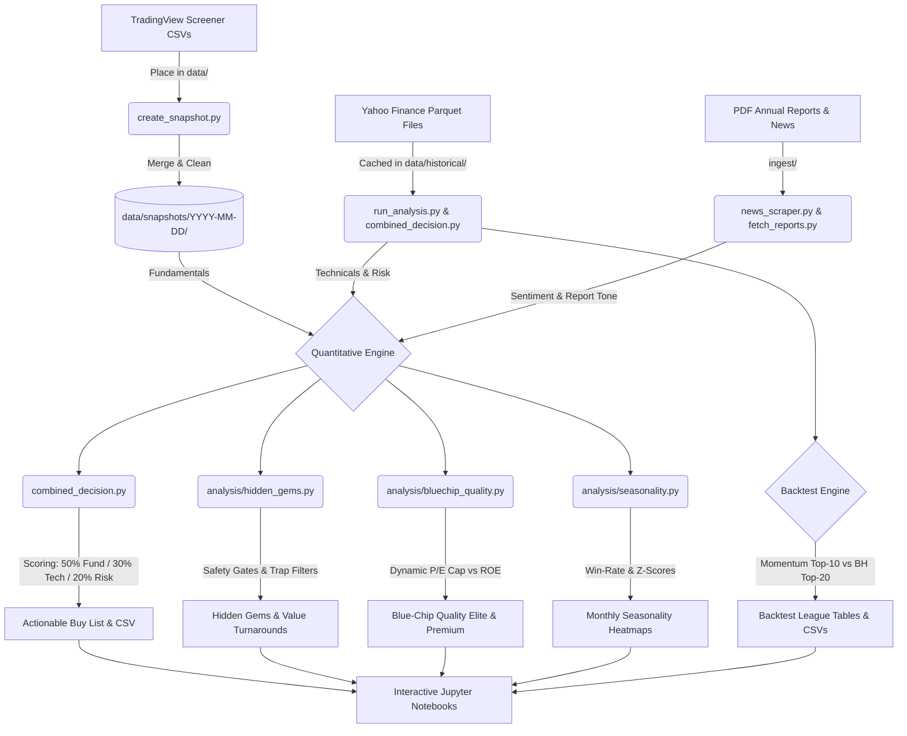

# 🇿🇦 JSE Stock Analysis & Backtesting System

A production-grade, multi-dimensional quantitative investment and research platform tailored for the **Johannesburg Stock Exchange (JSE)**. 

This platform aggregates 5-year historical pricing datasets (Yahoo Finance) and real-time screener metrics (TradingView exports) to scan, filter, rank, and backtest sophisticated investment strategies. It incorporates fundamental analysis, technical indicators, seasonality tracking, PDF annual report sentiment analysis, and safety-gated screener engines.

---

## 📊 System Architecture & Data Flow

Below is the workflow showing how data flows from external ingestion through our quantitative engine to generate actionable portfolios and backtesting reports.



---

## 🛠️ Core Capabilities & Investment Screens

### 1. JSE Combined Decision System (`combined_decision.py`)
Merges fundamental growth metrics with technical indicators and historical risk data to synthesize a single unified score for all liquid stocks.
* **Scoring Weights:** 
  * 📈 **50% Fundamentals:** EPS growth, Return on Equity (ROE), Net Profit Margin, Revenue Growth, Debt-to-Equity, and Current Ratio.
  * 📉 **30% Technicals:** Trend (above SMA50 & SMA200), 12-month momentum, RSI sweet-spot (40-60), and MACD crossovers.
  * 🛡️ **20% Risk:** Annual Sharpe ratio, Maximum Drawdown (1-year), and Annualized Volatility.
* **Liquidity Gate:** Excludes stocks trading less than **R1,000,000/day** average daily value to ensure easy entry and exit.
* **Outputs:** Generates an **Actionable Buy List** (Top 25) and an **Avoid List** (Bottom 10).

### 2. Hidden Gems & Value Turnarounds (`analysis/hidden_gems.py`)
Finds fundamentally excellent companies that are currently out-of-favor or ignored by the market (the *"beaten-down ready to run"* opportunities).
* **Hardened Against Value Traps (v2.0):** Automatically flags accounting anomalies (e.g., massive paper margins diverging from deeply negative Free Cash Flow margins; shell company flags with <50 employees but multi-billion market caps; and extreme EPS spikes unsupported by revenues).
* **v2.1 Safety Gates:**
  * **Valuation Cap:** Blocks paying $>20\text{x}$ earnings for a "hidden gem" to avoid overpaying.
  * **Liquidity Floor:** Enforces a strict minimum of **R10,000,000/day** volume.
  * **Falling-Knife Guard:** Excludes any stock down more than **30% in the last 3 months** (relabeling cold trends to *"Falling — verify"*).
* **Value Turnarounds:** Flags profitable, historically robust businesses pulling back into attractive discount zones.

### 3. Blue-Chip Quality Screener (`analysis/bluechip_quality.py`)
Designed to catch premium, compounding market leaders (e.g., Standard Bank, Naspers, Shoprite, MTN) that are rarely "cold" or "hidden" but represent high-quality shareholder value.
* **Dynamic P/E Cap:** High-ROE, high-growth businesses deserve premium multiples. The screener uses a dynamic P/E cap:
  $$\text{P/E Cap} = 15.0 + \text{ROE Bonus (up to +5x)} + \text{EPS Growth Bonus (up to +5x)} \quad (\text{Max } 35\text{x})$$
* **Timing Signals:** Recommends entry timing based on RSI indicators (e.g., *Oversold — Buy*, *Accumulate*, *Wait — Overbought*).

### 4. Seasonality Analyzer (`analysis/seasonality.py`)
Processes historical monthly returns over the last 5+ years to detect recurring, calendar-based performance trends.
* **Z-Scored Magnitude:** Calculates z-scores of average returns for each month relative to the stock's cross-sectional history.
* **Consistency Check:** Measures win-rate consistency (months with positive returns).
* **Warnings:** Issues a warning flag if a stock is entered during a historically weak calendar month.

### 5. News & Annual Report Sentiment Ingestion (`ingest/`)
Examines unstructured text data to identify corporate sentiment trends.
* **PDF Parser & Text Extractor (`fetch_reports.py`):** Downloads and parses annual report PDFs.
* **Report Analyzer (`analysis/report_analyzer.py`):** Scores report tone (optimistic vs. pessimistic).
* **Sentiment Integration:** Tone scores apply a bonus/penalty (up to **$\pm 5$ points**) directly to the Growth Score.

### 6. Momentum Strategy Backtester (`run_analysis.py`)
Vectorized backtesting system evaluating a classic dual-momentum trading strategy on JSE historical data.
* **Strategy:** Every 3 months (quarterly), the portfolio selects the **Top 10** liquid stocks by 12-1 month momentum (12-month return excluding the most recent month).
* **Execution:** Equal-weighted, incorporating transaction costs (0.5%), a liquidity filter, and comparison against an **Equal-Weighted Buy-and-Hold Top 20** benchmark proxy.

---

## 📂 Project Directory Structure

```lis
South_African_Stocks/
├── config/                 # Configuration & settings
│   ├── settings.py         # Sector outlooks, scoring weights, list of JSE tickers
│   └── __init__.py
├── core/                   # Core data models and file loaders
│   ├── data_loader.py      # Historical parquet loader & return computation
│   ├── models.py           # Structuring fundamental, technical, & growth dataclasses
│   └── __init__.py
├── analysis/               # Primary quantitative modules
│   ├── growth.py           # Combined GrowthAnalyzer (Fundamentals + Technicals + Sentiment)
│   ├── hidden_gems.py      # Hidden Gems screener (with value trap & falling-knife guards)
│   ├── bluechip_quality.py # Quality screener (with dynamic P/E multiple caps)
│   ├── seasonality.py      # Z-scored monthly returns & consistency analyzer
│   ├── report_analyzer.py  # Annual reports sentiment & tone scorer
│   ├── technical.py        # Technical indicator formulas (RSI, SMA, EMA, MACD, BB)
│   ├── fundamental.py      # Fundamental metrics loader & scorer
│   ├── sentiment.py        # Sentiment analysis on news feeds
│   ├── snapshot_store.py   # Snapshot directory manager (Parquet & CSV backups)
│   ├── snapshot_ranker.py  # Snapshot ranking compiler
│   ├── snapshot_tracker.py # Historical snapshot performance tracer
│   ├── predictor_2026.py   # Future year projections & sector tailwind matrices
│   ├── backtest.py         # Vectorized backtesting classes
│   └── __init__.py
├── ingest/                 # Scrapers and report collectors
│   ├── news_scraper.py     # RSS finance news scraping
│   ├── fetch_reports.py    # General financial reports scraper
│   ├── fetch_annual_reports.py # Automated PDF downloader for JSE stocks
│   └── __init__.py
├── utils/                  # Ingestion helper libraries
│   ├── tradingview_importer.py  # Standardizes TradingView CSV columns
│   ├── tradingview_snapshot.py  # Merges multiple JSE TradingView CSV exports
│   └── visualization.py    # Returns and backtest plotting utilities
├── notebooks/              # Jupyter Research & Visualization Notebooks
│   ├── analysis_notebook.ipynb  # Main market dashboard & technical screenings
│   ├── bluechip_quality.ipynb   # Compounding leader visual screener
│   ├── hidden_gems.ipynb        # Contrarian value plays research
│   ├── decision_system.ipynb    # Actionable JSE Buy List compiler
│   └── nb_helpers.py            # Plotting and formatting helper functions
├── data/                   # System database (ignored by Git if empty/temporary)
│   ├── historical/         # 5-year historical pricing parquet datasets for 245+ stocks
│   ├── snapshots/          # Compiled combined fundamental/technical snapshots
│   ├── reports/            # Cached annual report PDFs and raw text
│   └── news/               # Cached corporate news feeds
├── outputs/                # Ranked CSV lists, backtest performance datasets
├── requirements.txt        # System library requirements & package list
├── run_analysis.py         # Command-line backtester & technical metrics generator
├── combined_decision.py    # Command-line actionable buy/avoid list synthesizer
└── create_snapshot.py      # Interactive TradingView exports aggregator
```

---

## ⚡ Setup & Quick-Start Execution Guide

### 1. Clone the repository and install requirements
Ensure you have Python 3.9+ installed, then run:
```bash
pip install -r requirements.txt
```

### 2. Update Screener Data (Aggregating Snapshots)
If you have new CSV exports from the TradingView JSE screener:
1. Place the CSV export files in the `data/` folder.
2. Run the interactive snapshot creator:
   ```bash
   python create_snapshot.py
   ```
3. Confirm the discovered CSV files. The script will automatically merge them, resolve data conflicts, and save a unified snapshot (Parquet & CSV) in `data/snapshots/YYYY-MM-DD/`.

### 3. Generate the Actionable Buy List
To run the combined quantitative engine and calculate the final JSE Buy/Avoid rankings, run:
```bash
python combined_decision.py
```
This processes the latest fundamentals snapshot and matches it with 5-year historical calculations to output:
* **The Actionable Buy List (Top 25 Liquid Stocks)**
* **The Avoid List (Bottom 10 Liquid Stocks)**
* A deep dive into the top 5 picks, detailing EPS growth, ROE, margins, trend alignment, Sharpe ratios, and drawdowns.
* Saved CSV results in `outputs/combined_decision_ranked.csv`.

### 4. Run Backtesting & Full Technical Leagues
To run a comprehensive technical analysis on all 245 JSE stocks and backtest the Momentum Strategy (Top-10 quarterly rebalanced) vs. Buy-and-Hold, run:
```bash
python run_analysis.py
```
This outputs:
* Full signal distributions (BUY, HOLD, SELL ratios).
* Top 20 and Bottom 10 technical score tables.
* A strategy comparison dashboard comparing annualized returns, volatilities, Sharpe ratios, maximum drawdowns, and transaction cost impacts.
* Saved CSV outputs in `outputs/` for graphing.

### 5. Interactive Notebook Analysis
Launch Jupyter Notebook to inspect the graphical dashboards:
```bash
jupyter notebook
```
Open these premium research workbooks:
* **`notebooks/decision_system.ipynb`**: Interactive dashboard compiling and customizing the JSE Buy List.
* **`notebooks/hidden_gems.ipynb`**: Deep dive into undervalued turnaround plays with visual safety-gate filters.
* **`notebooks/bluechip_quality.ipynb`**: Elite compounding stock screener with dynamic valuation caps.
* **`notebooks/analysis_notebook.ipynb`**: General market review, technical grids, and seasonality return heatmaps.

---

## 🛡️ Disclaimer
This analysis system is designed purely for quantitative research and informational purposes. Past performance does not guarantee future results. Stock trading and investing on the Johannesburg Stock Exchange (JSE) carry substantial risk, and you should always conduct independent research or consult a registered financial advisor before making investment decisions.
